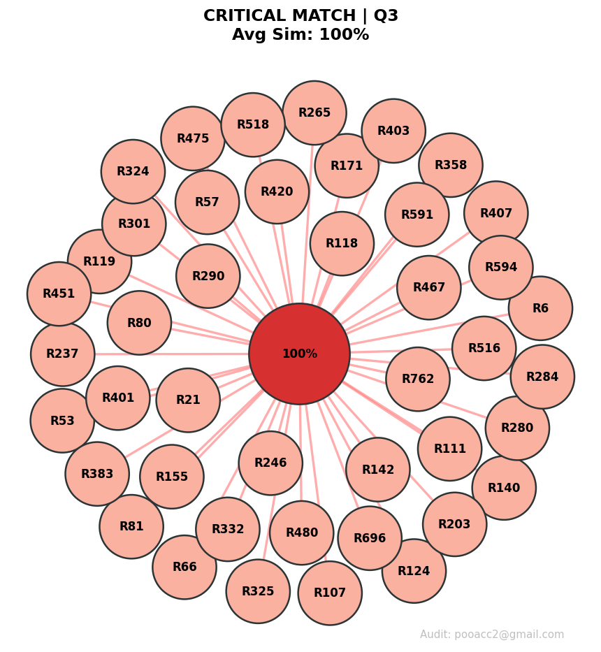
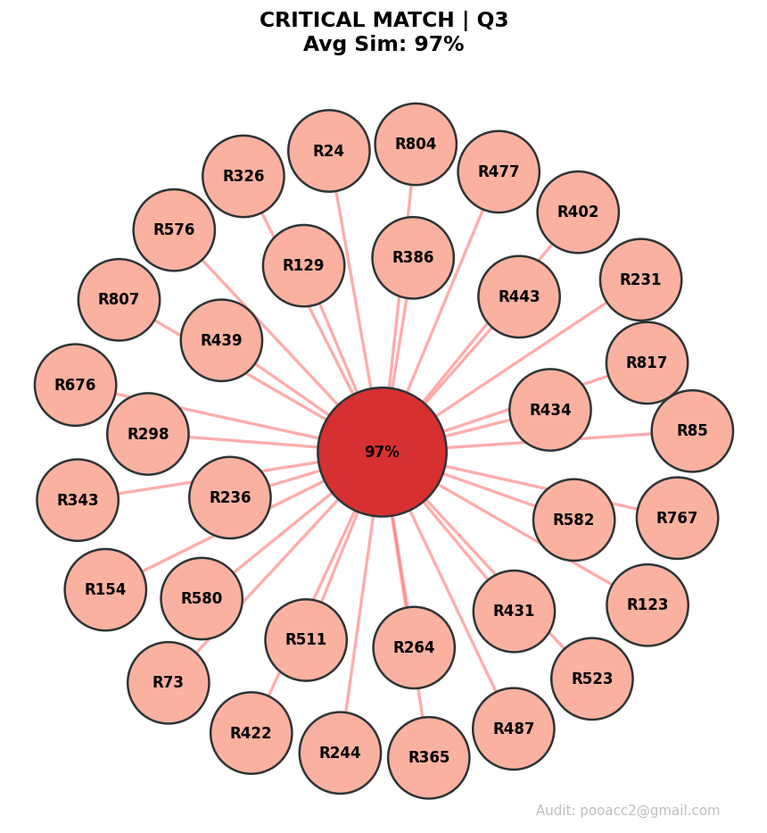

# LeetCode Integrity Crisis: Structural Plagiarism Report

An analysis of 1000+ solutions from recent LeetCode Weekly/Biweekly contests using a custom **Structural Anti-Cheat Engine**. This report uncovers massive plagiarism networks consisting of 40+ individuals sharing identical logic skeletons.

## 📊 The Discovery: Mass Cheating Clusters

My engine identified several high-density clusters where participants submitted structurally identical code. These are not 'similar ideas' — these are mathematically identical AST (Abstract Syntax Tree) signatures.

### 🔴 CRITICAL PLAGIARISM NETWORK Q3
- **Similarity:** 100%
- **Group Size:** 43 nodes (participants)
- **Evidence:** Ranks [6, 21, 53, 57, 66, 80, 81, 107, 111, 118, 119, 124, 140, 142, 155, 171, 203, 237, 246, 265, 280, 284, 290, 301, 324, 325, 332, 358, 383, 401, 403, 407, 420, 451, 467, 475, 480, 516, 518, 591, 594, 696, 762] share identical logic signature. Logic structure matching confirmed.
- **Violation:** PLAGIARISM NETWORK DETECTED
- **Method:** N-Gram Token Matching.

### 🔴 CRITICAL PLAGIARISM NETWORK Q3
- **Similarity:** 95%
- **Group Size:** 33 nodes (participants)
- **Evidence:** Ranks [8, 39, 114, 183, 194, 218, 227, 240, 263, 281, 294, 307, 311, 313, 317, 351, 353, 357, 364, 367, 390, 418,
436, 470, 472, 506, 512, 596, 751, 761, 814, 928, 999] share identical logic signature. Logic structure matching
confirmed.
- **Violation:** PLAGIARISM NETWORK DETECTED
- **Method:** N-Gram Token Matching.

**YOU CAN SEE THE SCALE OF THE ISSUE IN FULL PDF WITH EVIDENCE, VIOLATIONS and IMAGES**

---
### The Methodology (Why the Engine is Accurate):

To avoid 'False Positives' and catch 'Smart' cheaters, the engine uses a multi-stage detection pipeline:
**Hash Collision Detection:** Instant identification of 100% byte-for-byte identical code.
**Structural Signature Analysis:** It strips variable names and comments to analyze the logic skeleton.
**Fuzzy N-Gram Matching:** It detects plagiarism even if a user reorders methods, wraps them in different classes, or changes if/else to lambdas and other methods.

The engine is not looking for similar ideas. It is looking for identical logic skeletons. Ideas are common; identical structural patterns among 40 strangers are a leak.

### Why my engine is 'safe' for honest players:

1. **Structure priority.**
**This is the most important mathematical defense.**
1.1 **The Problem:** In programming, it often happens that two people name variables identically (n, ans, res, dp). If you compare only the text (r_logic), the engine might think it's plagiarism.
1.2 **How i solve it:** We take the AST (Abstract Syntax Tree) the 'skeleton' of the logic.
If one player used a for inside an if, and the other used a while without an if, their AST signatures will be completely different.
1.3 **Example:** Even if both players have r_logic = 0.9 (the same words), but one solved the problem using recursion and the other using iteration, their r_ast will be around 0.4.
1.4 **Final score:** (0.4 * 0.7) + (0.9 * 0.3) = 0.28 + 0.27 = 0.55. That's 55%—the system won't touch them.

2. **Cross-Language protection.**
**My engine can switch between 'deep' and 'universal' analysis.**
2.1 - If we compare Python with Python, the ultra precise AST analysis is triggered (r_ast > 0)
2.2 - If we compare Python with Kotlin (or C++), the AST parser will return an error or an empty string. The if r_ast > 0 condition will fail, and the code will switch to combined_sim = r_logic.
2.3 - **Result:** For Python players, protection is maximum (it's almost impossible to accidentally ban them). For other languages, my advanced Regex skeleton is used, which is still better than a simple text comparison, since it strips out variable names.

3. **Exclusion of short solutions (len(code) > 40):**
**This is a defense against 'obvious' one or two line solutions.**
3.1 **The Problem:** Easy (Q1) level problems or simple parts of Q2 often have only one logically correct solution, a couple of lines long.
3.2 **Example:** return sorted(nums)[-2] – thousands of people will write this.
3.3 **How i solve it:** A 40-character filter eliminates such cases. We analyze only the meaningful code (Q3 and Q4), where the probability of a 90% random structure match is practically zero.
3.4 **Result:** The engine ignores the 'noise' from simple problems and focuses on complex algorithms where code theft is most visible.

---

## 📄 Full Audit Report
The complete detailed report with all clusters, rank numbers, and evidence is available here:
[**Download/View Full PDF Report (v1.0)**](./LEETCODE_AUDIT_REPORT_.pdf)

---

## 🎯 Goal
I hope this data helps the LeetCode Engineering Team improve the contest environment. Modern cheating has evolved beyond simple text matching, and detection systems must evolve too.

| Feature | Current LeetCode Detection | My AST-Structural Engine |
| :--- | :--- | :--- |
| **Detection Basis** | Text/Token-based | **AST Logic Skeleton** |
| **Bypass Difficulty** | Low (Rename variables/comments) | **High (Requires full logic rewrite)** |
| **Scalability** | Unknown | **50,000+ solutions in < 5 mins** |
| **Codebase** | Heavy/Legacy | **Extremely Lean (< 2,000 lines)** |

**Contact:** pooacc2@gmail.com
